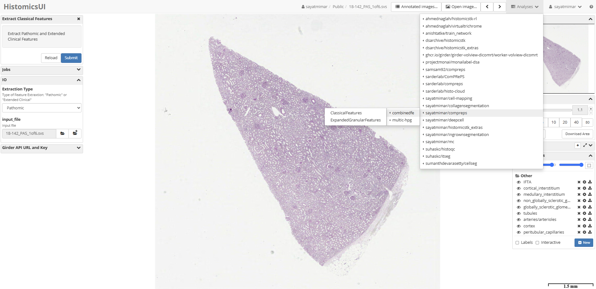
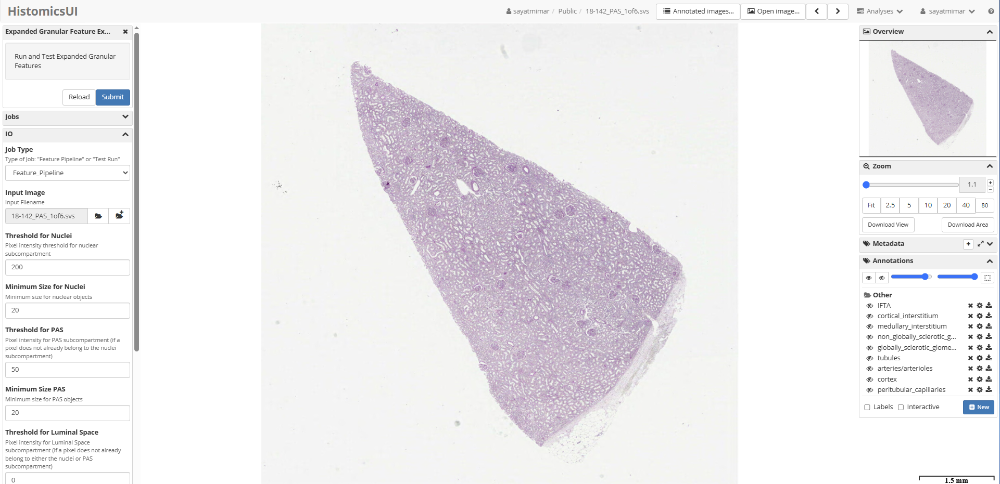
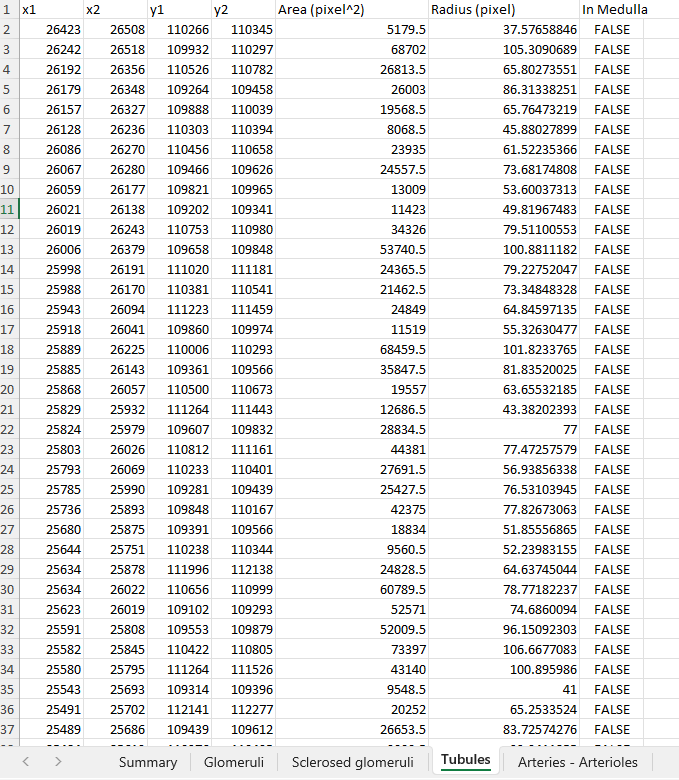

# CombinedFeatureExtraction

## Introduction

Combined Feature Extraction is a collection of 3 pipelines for extracting and quantifying morpometrics from segmented masks. It contains the following [Digital Slide Archive](https://athena.rc.ufl.edu/) (DSA) plugins developed by [CMI Lab](https://cmilab.nephrology.medicine.ufl.edu/) at the University florida:

- ClassicalFeatures
    - Pathomic
    - Extended Clinical
- ExpandedGranularFeatures

At the high level using image analysis techniques, the plugin extracts image and contour-based pathomic features; namely, area, mesangial area for each glomerulus, average TBM tickness, average cell thickness and luminal fraction for each tubule and arterial area for each artery. The extended clinical features also include Area and Radius of each FTU. The FTUs are comupted by the [Multi-Compartment segmentation model](https://github.com/SarderLab/Multi-Compartment-Segmentation).

The expanded granular plugin performs Sub-compartmentalization of Kidney microanatomical structures. Namely, Nuclei, Eosinophilic and Lumen. Afterwards, it extracts the following features: Morphological, Texture, Color and Distance transform.

Once the feature extraction jobs are run in the HistomicsUI, the extracted features are uploaded as an excel spreadsheet under the item it corresponds to. The spreadheets can be downloaded and used for other downstream analyses.

## Quick Start Guide

1. The ClassicalFeatures plugin shown in HistomicsUI. The user can select Pathomic or Extended Clinical in the box on the left.

2. ExpandedGranularFeatures plugin shown in HistomicUI. The user can adjsut hyperparameters and run a "Test Run" before running the Feature Pipeline.

3. A Sample excel spreadsheet output is shown below. Eeah features for each FTU is added in a different tab.

## References

1. Correlating Deep Learning-Based Automated Reference Kidney Histomorphometry with Patient Demographics and Creatinine by Lucarelli N. et. al. Kidney360 4(12):p 1726-1737, December 2023. | DOI: 10.34067/KID.0000000000000299

